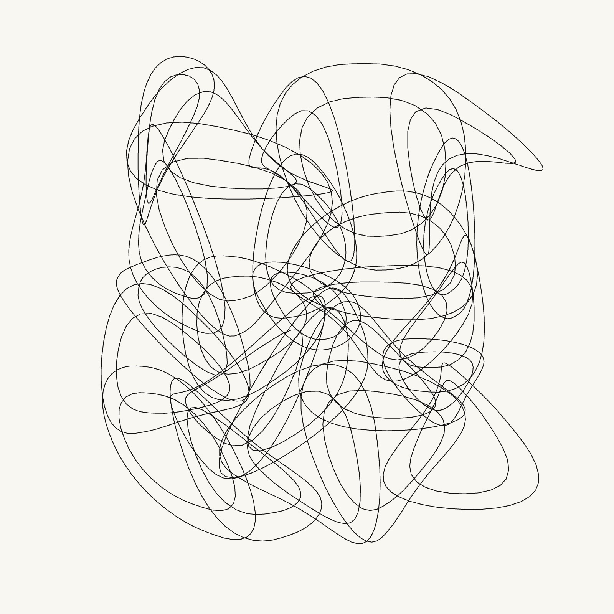
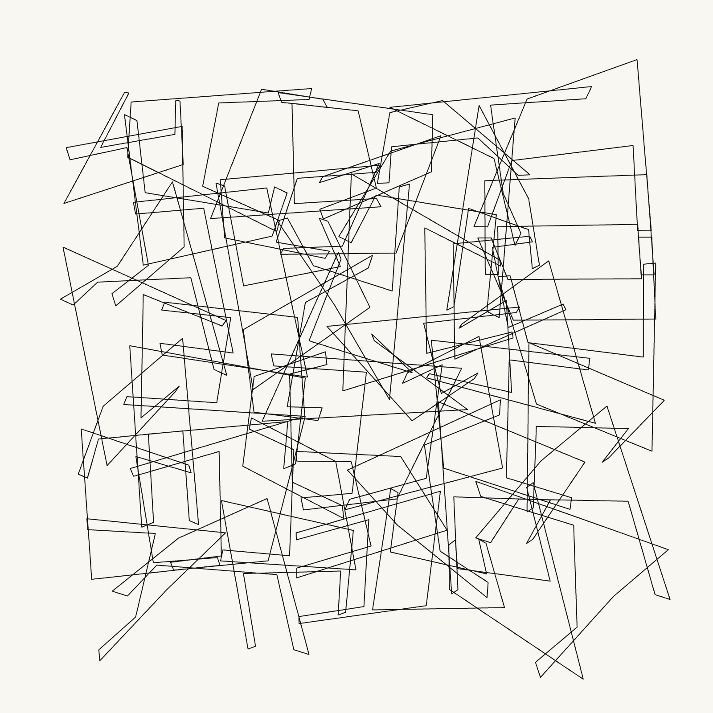
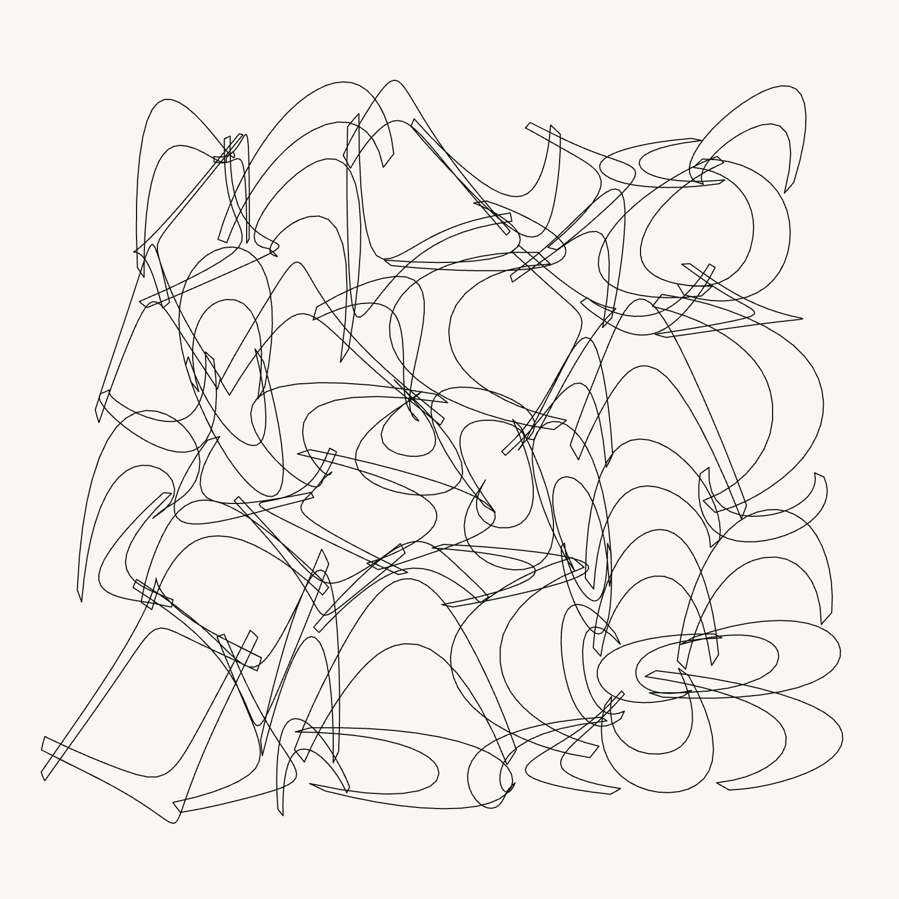
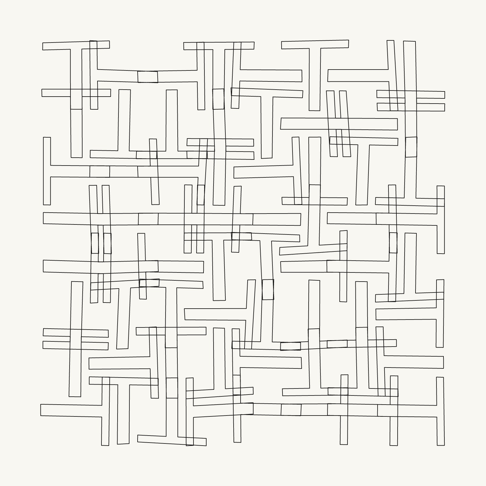
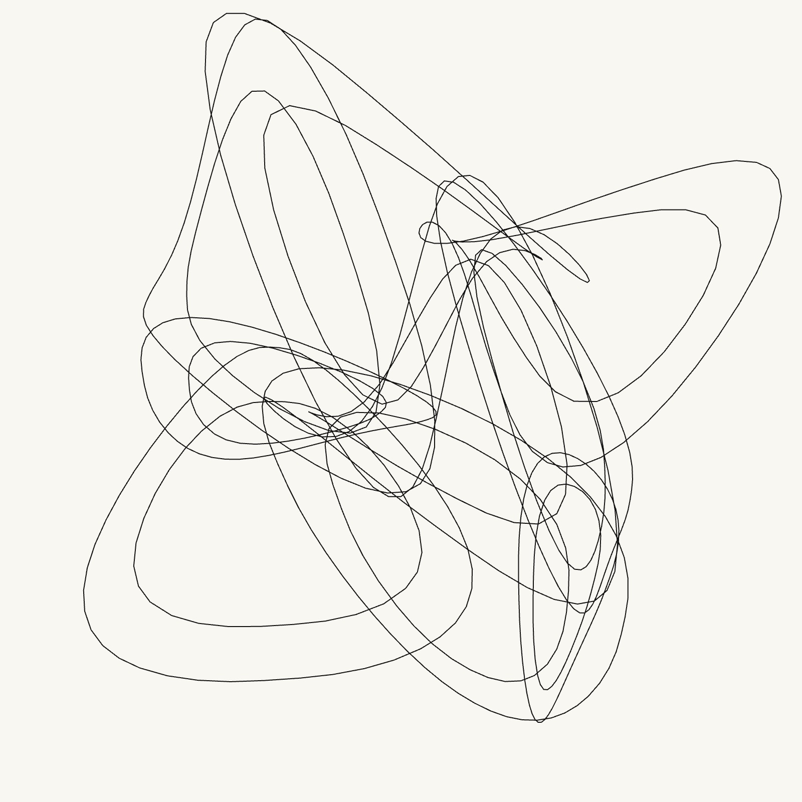
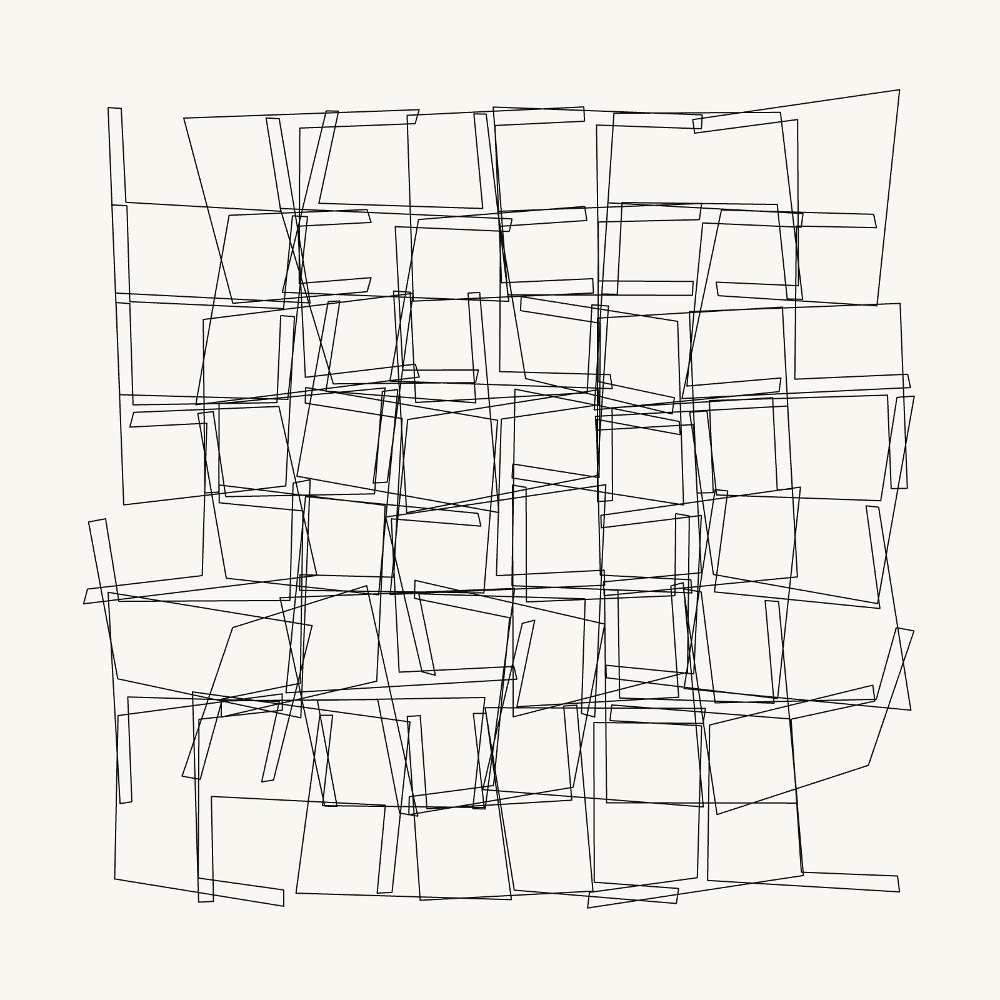
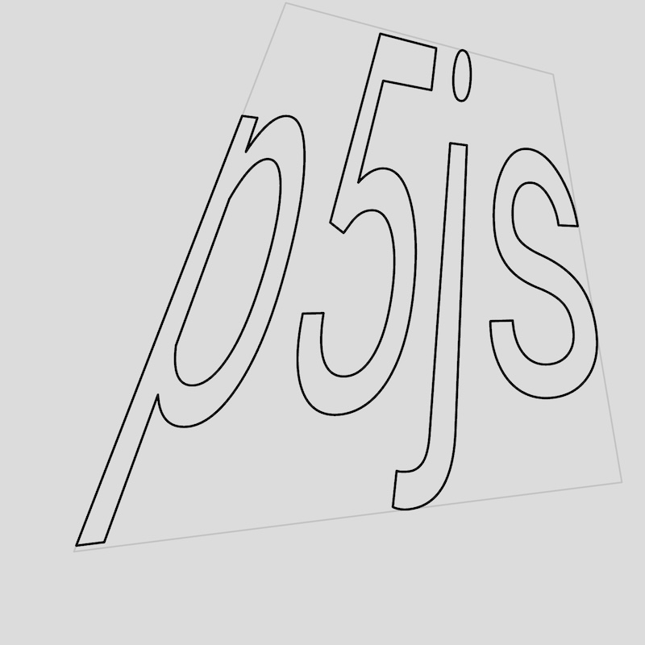

# CCFest26 — Generative art framework

https://ccfest.rocks/

Participants were guided in building a small generative system based on seeded randomness, showing how simple rules, parameter controls, and reproducible outputs can create endless visual variation.



## Sketches collection
https://editor.p5js.org/v3ga/collections/of1JrIKH5

### Roll dices
<em>"In most implementations if not in all, ```Math.random```'s generator is silently seeded at startup by some supposedly random value, usually the present time to the millisecond or whatever other granularity the system provides.

This means that there is no easy way to repeat a series of pseudo-random numbers in order, e.g., to determine what went wrong in a simulation. It also means that you cannot give your code to a colleague and expect that she will find what you want to show. Anything that uses ```Math.random``` is inherently not portable."</em>

From [dworthen/prng repository](https://github.com/dworthen/prng?tab=readme-ov-file#no-standard-way-to-repeat-sequences)

### Design a programme
- Create a deformed grid.  
- Use glyphs | letters to fill grid's cells.
- Generate random composition, explore the possible.

### Control the programme
- Build interface to control the chance.
- Save nice outputs for later restoring.

## Useful procedures
Some top-level functions are included in ```utils.js``` file.

### Random
Useful functions that are built upon ```random_dec()```function that returns a number between ```0.0``` and ```1.0```
Using [prng](https://github.com/dworthen/prng) repository
```js
// --------------------------------
// random number between a (inclusive) and b (exclusive)
var random_between = (a, b) => { return a + (b - a) * random_dec() }

// --------------------------------
// random integer between a (inclusive) and b (inclusive)
// requires a < b for proper probability distribution
var random_int = (a,b) => {return Math.floor(random_between(a, b + 1))}

// --------------------------------
// random value in an array of items
var random_choice = (a) => { return a[random_int(0, a.length - 1)] }

```

### Typography
https://editor.p5js.org/v3ga/sketches/f9_-ZmzGa


```js
// ----------------------------------------------------
// Given a font and a string, returns an array of
// vertices arrays mapped to the curves list of the string glyphes
// 
// opts.bNormalize (true | false), normalizes vertices wrt glyphes bounding box
// opts.uniforms.nb (int >=2 ), sample parameters for each glyph curves 
function getVerticesUniformForString(font,str,xStr,yStr,fontSize,opts={})
{
  // ...
}
```

### Geometry
https://editor.p5js.org/v3ga/sketches/QV2lJ4YfD



```js
// ----------------------------------------------------
// returns vertices (array) distributed on a grid
function getGridVertices(x,y,w,h,resx,resy, opts={})
{
  // ...
}

// ----------------------------------------------------
// vertices is an array of normalized p5.Vector
// returns an array of vertices "projected" in the quad
// defined by quadVertices
// 
// opts.offset : integer for right offseting the quadVertices (ie rotating vertices by 90° steps)
// opts.offset = 1 : [A,B,C,D] -> [D,A,B,C]
function getVerticesInQuad(vertices, quadVertices, opts={})
{
  // ...
}
```

### User interface
See example here : https://editor.p5js.org/v3ga/sketches/-QbjsKGf4


